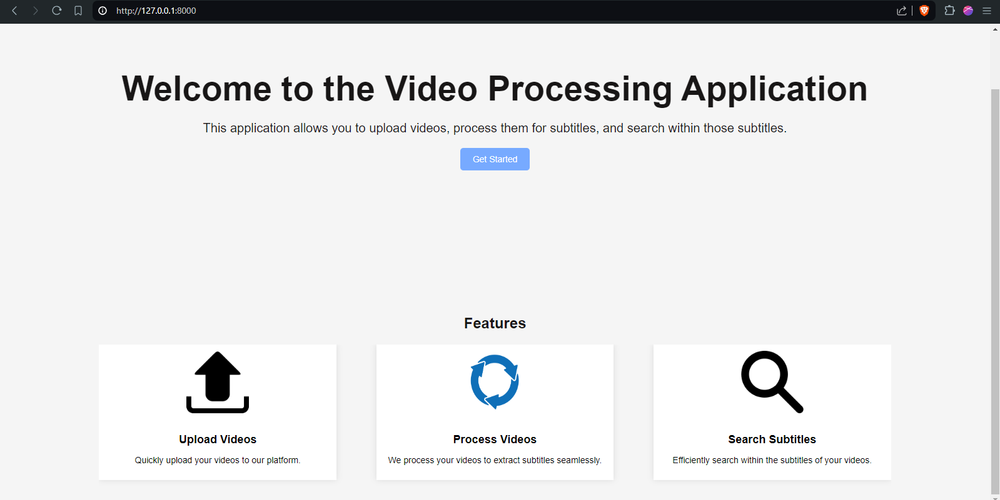
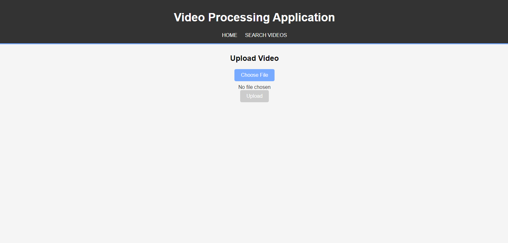
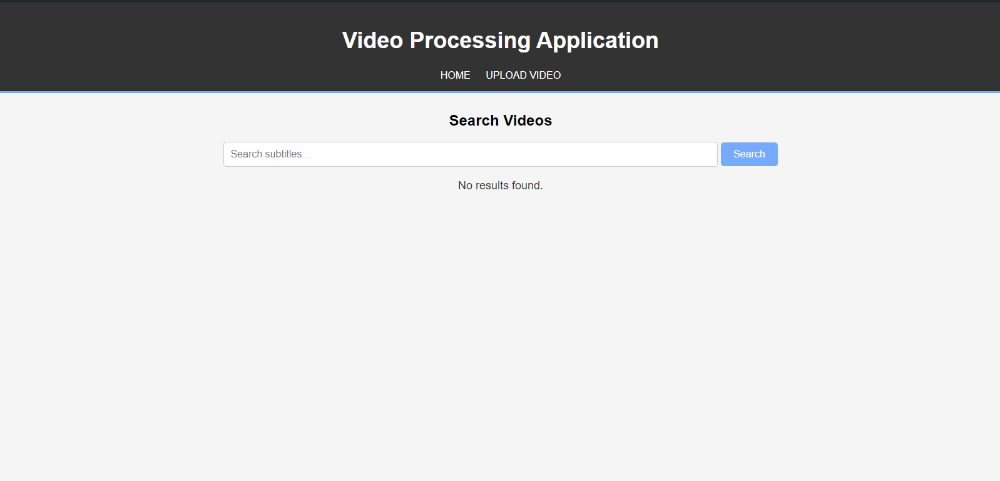
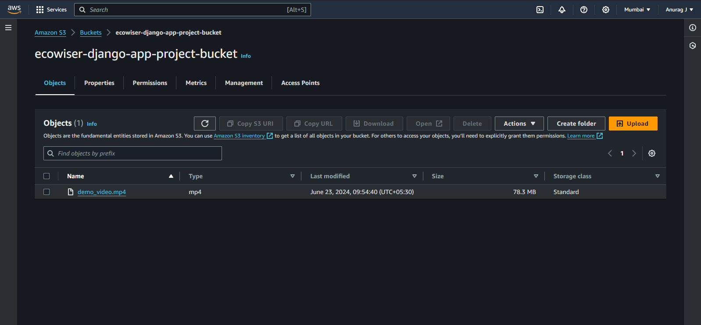
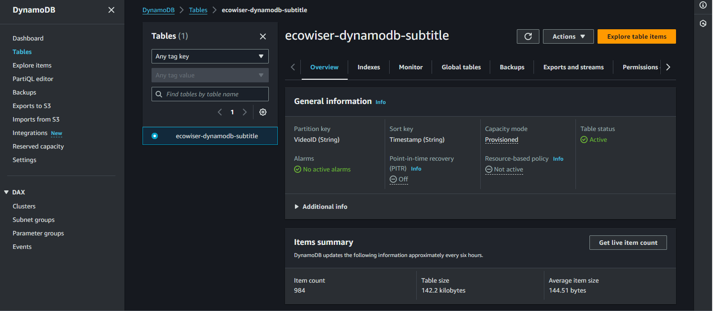

# Video Processing App

This Django REST Framework project provides an API for processing videos. The API accepts a video file, processes it to extract subtitles, and stores the video and subtitles in AWS S3 and DynamoDB respectively. The application utilizes Celery for handling background tasks to ensure scalability and responsiveness.

## Features

- **Django REST Framework**: Built using Django and Django REST Framework for creating APIs.
- **Celery**: Asynchronous task queue for handling background tasks.
- **CCExtractor**: Tool for extracting subtitles from video files.
- **DynamoDB**: NoSQL database service for storing extracted subtitles.
- **S3 Bucket**: AWS S3 for storing video files.
- **Boto**: AWS SDK for Python to connect and interact with AWS services.

## Prerequisites

- Python Environment
- Django
- Django REST Framework
- Celery
- CCExtractor
- Boto3 (for AWS)
- AWS Account (for S3 and DynamoDB)
- Code editor (VSCode)

## Installation

Step 1: Download and Install required packages
```bash
pip install django djangorestframework celery boto3
```

Step 2: Install CCExtractor
```bash
https://github.com/CCExtractor/ccextractor
```

## Setting Up the Application

1. **Configure Django and Django REST Framework**: Set up a new Django project and add Django REST Framework to the installed apps.
2. **Celery Configuration**: Configure Celery in your Django project for background task processing.
3. **AWS Configuration**: Set up AWS credentials for Boto3 to connect to S3 and DynamoDB.
4. **CCExtractor Integration**: Integrate CCExtractor for extracting subtitles from video files.

## Running the Application

Use the following endpoints to interact with the API:

- Start video processing:
  
  ```bash
  /api/taskmanager/start_processing
  ```
  ```
  /api/taskmanager/processing_status/<job_id>
  ```

<h2>Output</h2>

*Home Page*


*Upload Panel*


*Celery Connect Page*


*s3 - AWS*


*DynamoDB - AWS*



